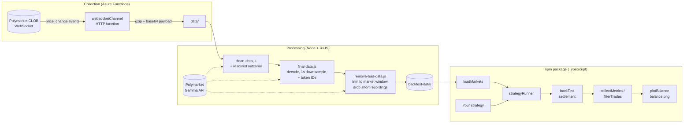

# Polymarket BTC Up/Down 5m — Backtester

**A TypeScript library for writing and backtesting trading strategies on Polymarket's 5-minute Bitcoin "Up or Down" prediction markets, plus the serverless data pipeline that collects the tick data it runs on.**


---

## Overview

Every 5 minutes, Polymarket opens a new binary market: *"Will Bitcoin be up or down at the end of this 5-minute window?"* Each market has two tokens, **UP** and **DOWN**, priced between $0 and $1. When the market resolves, the winning token pays out $1 per share and the losing token pays $0.

Polymarket does not expose historical order-book data at the tick level for these markets, so testing a strategy against them means building the dataset first. This project does both halves:

1. **Data collection & processing.** An Azure Function subscribes to Polymarket's CLOB WebSocket for a market, records every `price_change` event until the market resolves, and returns the stream gzip-compressed. A set of Node scripts then enriches each recording with its resolved outcome and token IDs from the Gamma API, downsamples it to one snapshot per second, and filters out incomplete or post-resolution data.
2. **A backtesting library, packaged for npm.** Strategies are plain functions that receive each market tick along with helpers like `buy()` and `end()`. The engine replays every recorded market, simulates fills at the best ask, settles each position against the real outcome, and reports win rate, trade statistics, and the balance curve.

## Highlights

- **Small strategy API.** A strategy is a factory function; the engine creates a fresh instance per market, so per-market state lives naturally in a closure.
- **Realistic settlement model.** Trades fill at the best ask and settle with binary $1/$0 payouts using each market's actual resolved outcome.
- **Full action trace.** Every trade is recorded with price, shares, stake, timestamp, market slug and outcome, so any result can be audited trade by trade.
- **Built-in analytics.** Win rate, average entry price, trade frequency, winning/losing trade indexes, and a trade filter for slicing results by outcome, side or price band.
- **Balance chart export.** Renders the equity curve to a 1920×1080 PNG with Chart.js on a Node canvas.
- **Typed and published as a package.** Written in strict TypeScript, compiled to ESM with declaration files, and consumable as an npm package.
- **Serverless ingestion.** The collector is an HTTP-triggered Azure Function (v4 Node programming model) that handles WebSocket subscription, resolution detection, timeout and compression.

## Architecture



## Repository structure

```
.
├── src/                          # The npm package (TypeScript)
│   ├── core/
│   │   ├── backtest.ts           # Loads markets, runs the strategy, settles trades
│   │   ├── strategy-runner.ts    # Replays one market tick by tick, exposes helpers
│   │   └── metrics.ts            # Statistics and trade filtering
│   ├── models/                   # Types: market data, actions, results
│   ├── utils/
│   │   ├── loader.ts             # Reads market files, parses slug/outcome/token IDs
│   │   └── plotting.ts           # Balance curve -> PNG
│   └── index.ts                  # Public API
├── azure_lambda_data_processor/  # Azure Function that records live markets
├── data-processing/              # Scripts that turn raw recordings into backtest data
└── test/                         # Example consumer project with sample strategies
```

## Using the library

### Install

Build and pack the library from source, then install the tarball in your own project:

```bash
git clone https://github.com/Kousay-Jebir/polymarket-btc-updown-5m-backtest.git
cd polymarket-btc-updown-5m-backtest
npm install
npm pack            # runs the TypeScript build, produces polymarket-btc-updown-5m-backtest-1.0.0.tgz

cd ../my-project
npm install ../polymarket-btc-updown-5m-backtest/polymarket-btc-updown-5m-backtest-1.0.0.tgz
```

> Plotting relies on `chartjs-node-canvas`, which uses the native `canvas` package. Most platforms get a prebuilt binary; if yours doesn't, see the [node-canvas install guide](https://github.com/Automattic/node-canvas#compiling).

### Quick start

```js
import { backTest, collectMetrics, filterTrades, plotBalance } from 'polymarket-btc-updown-5m-backtest';

// Buy whichever side first reaches 90¢, then stop trading this market.
const momentum = () => (tick, { buy, up, down, end }) => {
  if (up.best_ask >= 0.9) {
    buy('up', 1);        // stake $1 on UP at the current best ask
    end();
  } else if (down.best_ask >= 0.9) {
    buy('down', 1);
    end();
  }
};

const initial = { balance: 10 };
const result = await backTest('./backtest-data', momentum, initial);
const metrics = collectMetrics(result, initial);

console.log('Final balance:', result.finalState.balance);
console.log('Trades:', metrics.numberOfTrades);
console.log('Win rate:', metrics.winRate);
console.log('Avg entry price:', metrics.averageTradePrice);

// How many cheap entries (≤ 5¢) actually paid off?
const cheapWins = filterTrades(result.actionsTrace, { winning: true, maxPrice: 0.05 });
console.log('Cheap wins:', cheapWins.length);

await plotBalance(metrics.balanceEvolution); // writes balance.png
```

### Writing a strategy

A strategy is a **factory** with the type `() => (tick, helpers) => void`. The engine calls the factory once per market, then calls the returned function for every tick of that market in chronological order. Anything declared inside the factory is per-market state.

```ts
import type { Strategy } from 'polymarket-btc-updown-5m-backtest';

const lateFade: Strategy = () => {
  let traded = false; // resets for every market

  return (tick, { buy, up, down, end, differenceInSeconds, lastMarketEntry }) => {
    const secondsLeft = differenceInSeconds(tick.timestamp, lastMarketEntry.timestamp);

    if (!traded && secondsLeft <= 45 && up.best_ask >= 0.9) {
      buy('down', 1);   // fade the favourite in the last 45 seconds
      traded = true;
      end();
    }
  };
};
```

**Helpers passed on every tick**

| Helper | Description |
| --- | --- |
| `up`, `down` | Current state of each token: `best_ask`, `best_bid`, `price` (as numbers), plus `size`, `side`, `asset_id`. |
| `buy(token, stake)` | Buy `'up'` or `'down'` for `stake` dollars at the current best ask. Shares = `stake / best_ask`, truncated to 4 decimals. |
| `end()` | Stop processing the current market after this tick. |
| `differenceInSeconds(t1, t2)` | Absolute difference between two millisecond timestamps, in seconds. |
| `firstMarketEntry`, `lastMarketEntry` | First and last recorded ticks of the market, useful for time-in-market logic. |

### Settlement model

For each trade, once the market's outcome is known:

- **Win** (token matches outcome): `balance += shares − stake` (each share pays $1)
- **Loss**: `balance −= stake`

Trades are settled in chronological order across all markets. If the balance ever drops below zero, `finalState.error` records the index of the offending action.

### API reference

| Export | Purpose |
| --- | --- |
| `backTest(dataPath, strategy, initialState)` | Runs a strategy over every market file in `dataPath`. Returns `{ actionsTrace, finalState }`. |
| `collectMetrics(result, initialState)` | Returns `winRate`, `numberOfTrades`, `tradeProportion`, `idleProportion`, `averageTradePrice`, `averageWinningTradePrice`, `winningTradeIndexes`, `losingTradeIndexes`, `balanceEvolution`. |
| `filterTrades(actions, criteria)` | Filters the trace by `winning`, `token`, `minPrice`, `maxPrice`. |
| `plotBalance(balanceEvolution)` | Renders the balance curve to `balance.png`. |
| `loadMarkets(dirPath)` | Low-level loader that returns parsed markets with slug, outcome and token IDs. |
| Types | `Strategy`, `StrategyHelpers`, `StrategyAction`, `MarketEntry`, `LoadedMarket`, `BacktestResult`, `BacktestStatisticsResult`, `TradeFilterCriteria`, and more. |

## The data pipeline

### 1. Recording live markets (`azure_lambda_data_processor/`)

`websocketChannel` is an HTTP-triggered Azure Function (function-level auth). A `POST` with `{ "tokenId": "<clob token id>" }`:

1. opens a WebSocket to `wss://ws-subscriptions-clob.polymarket.com/ws/market` and subscribes to the token;
2. appends every `price_change` event (timestamp plus both tokens' best bid/ask) to an in-memory history;
3. finishes on `market_resolved`, or after a 3-minute safety timeout;
4. returns the history as **gzip + base64** to keep the HTTP payload small.

HTTP streaming is enabled so the function can hold the connection open for the lifetime of the market.

```bash
cd azure_lambda_data_processor
npm install
func start   # requires Azure Functions Core Tools v4
```

### 2. Turning recordings into backtest data (`data-processing/`)

Markets are identified by their start time: slugs follow `btc-updown-5m-<unix seconds>` and advance by 300 seconds, so the scripts walk the series from the first captured market (23 March 2026).

| Step | Script | What it does |
| --- | --- | --- |
| 1 | `clean-data.js` | Extracts the compressed payload from each raw capture and fetches the market's resolved outcome (`up`/`down`) from the Gamma API. |
| 2 | `final-data.js` | Decodes gzip + base64, looks up the UP/DOWN CLOB token IDs, and **downsamples to one snapshot per second** with an RxJS `groupBy` → `last()` pipeline. |
| 3 | `remove-bad-data.js` | Parses the market window from its title (e.g. *"Bitcoin Up or Down - March 23, 11:05AM-11:10AM ET"*), drops ticks recorded after the close, and discards recordings shorter than 2 minutes. |
| 4 | `check-data-integrity.js` | Writes a per-file summary (tick count, first/last timestamp, duration) to `backtest-summary.txt`. |

### Dataset format

Each market is one JSON file whose name carries its metadata, which the loader parses:

```
btc-updown-5m-<startUnix>-<outcome>-<upTokenId>-<downTokenId>.json
```

The file contains an array of ticks:

```json
[
  {
    "timestamp": "1774275012000",
    "price_changes": [
      { "asset_id": "<upTokenId>",   "price": "0.62", "size": "150", "side": "BUY",  "best_bid": "0.61", "best_ask": "0.63", "hash": "..." },
      { "asset_id": "<downTokenId>", "price": "0.38", "size": "150", "side": "SELL", "best_bid": "0.37", "best_ask": "0.39", "hash": "..." }
    ]
  }
]
```

The dataset itself isn't committed to the repository because of its size.

## Example strategies

[`test/index.js`](test/index.js) consumes the packaged library the way an external user would and includes several strategies explored during research:

- **Momentum at 90¢:** buy the side that first reaches a 0.90 ask.
- **Late fade:** buy against a 0.90–0.91 favourite in a window 40–45 seconds from the end of the recording.
- **Long-shot band:** buy a token trading in the 0.12–0.13 range.

## Assumptions and limitations

Knowing where a backtest is optimistic matters as much as the backtest itself. The current model:

- fills orders at the **best ask** without checking order-book depth, so large stakes are assumed to fill at the top of the book;
- does **not** model trading fees, latency or partial fills;
- only supports **buying and holding to resolution** (no selling before the close);
- works on **1-second snapshots**, so faster intra-second moves are not visible;
- converts Eastern Time to UTC with a fixed UTC−4 offset, which is correct for the captured period (EDT) but would need adjusting across a daylight-saving change.

## Roadmap

- Depth-aware fills using order-book size, plus configurable fees and slippage
- Sell / early-exit support
- Risk metrics: max drawdown, Sharpe ratio, profit factor
- Scheduled, fully automated collection (timer trigger + Blob Storage output)
- Unit tests for the settlement and metrics logic

## Tech stack

**Library:** TypeScript (strict, ESM, NodeNext), Chart.js, chartjs-node-canvas
**Collection:** Azure Functions (Node v4 model), `ws`, zlib
**Processing:** Node.js, RxJS, Polymarket Gamma & CLOB APIs

## Author

**Kousay Jebir** — Software Engineering student at INSAT (Tunis), focused on cloud, DevOps and infrastructure.

---

*This project is for research and educational purposes only and is not financial advice.*
